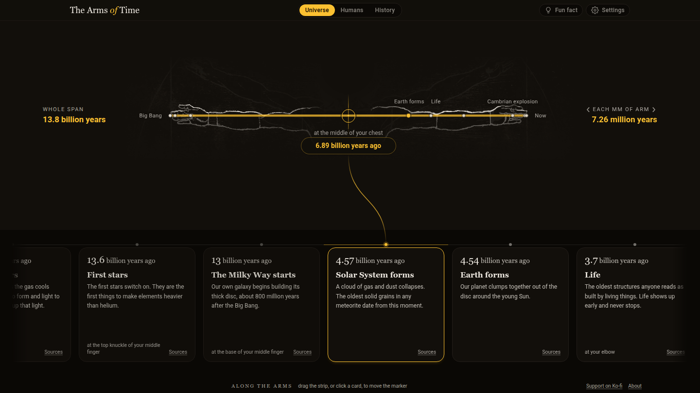

# The Arms of Time

The history of the universe, laid along your outstretched arms.

**[Open it: thearmsoftime.github.io](https://thearmsoftime.github.io)**

[](https://thearmsoftime.github.io)

[](https://ko-fi.com/G2G8JT2U9)

## What it is

Hold your arms out wide. The tip of your left hand is the Big Bang. The tip of
your right hand is today. Everything that ever happened fits in between.

On arms 1.90 m wide, each millimetre holds 7.26 million years. File one
fingernail with a single stroke, and you take off about 726,000 years. That is
longer than our species has existed.

The arms are those of Leonardo da Vinci's *Vitruvian Man*. Leonardo drew him to
show the measures of the human body. Here he measures time.

## How to use it

1. Pick a timeline at the top.
2. Drag the marker along the arms. The cards below say what happened there.
3. Hold out your own arms. The numbers at the sides say how much time each part
   of them holds.

Open **Settings** to enter your own arm span. Every number follows it.
Press **Fun fact** for a surprise you can measure. For example: Cleopatra lived
nearer in time to the Moon landing than to the building of the Great Pyramid.

## The timelines

Each timeline is one whole arm span. The right fingertip is always now.

| Timeline | The left fingertip | How long ago |
| --- | --- | --- |
| Universe | The Big Bang | 13.8 billion years |
| Life | The first traces of life | 3.7 billion years |
| Modern humans | The Great Pyramid | 4,600 years |

Two more, **Earth** and **Humans**, are still being researched. They come later.

On the human timelines, time is also counted in generations of about 27 years.

## In a classroom or a museum

- Free to use. No account, no adverts.
- Nothing is tracked. Nothing loads from other sites.
- Works on a phone, a tablet or a projector.
- Set the arm span to the person standing in front of it.

You may show it, copy it and change it. Please keep the credit (see
[Licence](#licence)).

## Where the dates come from

Every card links to Wikipedia and to the source of its date. Many dates are
not exact. Science gives them with a margin, like "± 5 million years". Open
**Settings** and set **Numbers** to **Science** to see that margin, on the card
and on the arm.

The research notes behind the data are in
[research/research.md](research/research.md).

**Found a mistake?** Please
[report it here](https://github.com/thearmsoftime/thearmsoftime.github.io/issues/new?template=mistake.yml)
and say which card, and what the right date or source is.

## Use of AI

This project was made with help from Claude, an AI model made by Anthropic.

- Claude wrote most of the code.
- Claude helped find the dates and their sources, and wrote first drafts of the
  text.
- A person chose what goes on the arms, checked the cards, and rewrote the
  wording.
- The lines of the drawing were traced by hand.

AI can make mistakes. That is one reason every date links to a source you can
check yourself.

## Licence

Use it, change it, even sell it. Only keep the credit.

| Part | Licence |
| --- | --- |
| The words, the dates and the design | [CC BY 4.0](https://creativecommons.org/licenses/by/4.0/) |
| The code | [MIT](https://opensource.org/license/mit) |
| The drawing by Leonardo | Public domain |

Credit it as **The Arms of Time**, with a link to
<https://thearmsoftime.github.io> where you can. The full text is in
[LICENSE](LICENSE).

## Credits

- **Drawing:** Leonardo da Vinci, *Vitruvian Man* (about 1490). Public domain.
  Scan by Luc Viatour, via
  [Wikimedia Commons](https://commons.wikimedia.org/wiki/File:Da_Vinci_Vitruve_Luc_Viatour.jpg).
- **Idea:** we thought of it ourselves, then found that others had it first.
  John McPhee laid the history of the Earth along a king's outstretched arm,
  in his book
  [*Basin and Range*](https://en.wikipedia.org/wiki/Annals_of_the_Former_World)
  (1981). The Natural History Museum of Los Angeles County made a short video
  of the same idea,
  [At Arm's Length](https://www.youtube.com/watch?v=uMXt0eGXuZc).
- **Generations:** 26.9 years, after
  [Wang and others (2023)](https://www.science.org/doi/10.1126/sciadv.abm7047),
  *Science Advances*.

## Support

The Arms of Time is free and has no adverts. If it is useful to you, a coffee
helps keep it going.

[](https://ko-fi.com/G2G8JT2U9)

## For developers

How it is built — the layout, the data, the drawing and the dev tools — is in
[DEVELOPMENT.md](DEVELOPMENT.md).

```bash
npm install
npm run dev
```
